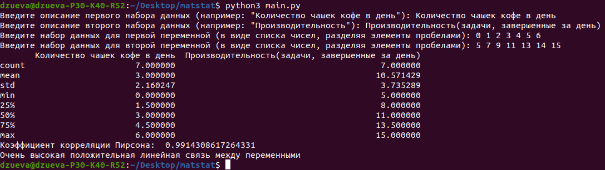

# Расчет методом корреляционного анализа
### как запустить программу:
установить все нужные библиотеки:\
`pip install --no-cache-dir -r requirements.txt`\
запустить скрипт:\
`python3 main.py`\
(важно! версия python должна быть не меньше 3)

### пример использования:
Используем программу для изучения связи между количеством выпитого кофе и производительностью труда. 
В качестве искусственного набора данных мы воспользуемся следующими значениями:\
**Количество чашек кофе в день**: 0, 1, 2, 3, 4, 5, 6.\
**Производительность (задачи, завершенные за день)**: 5, 7, 9, 11, 13, 14, 15.\
\
Запускаем `main.py`:\
\

